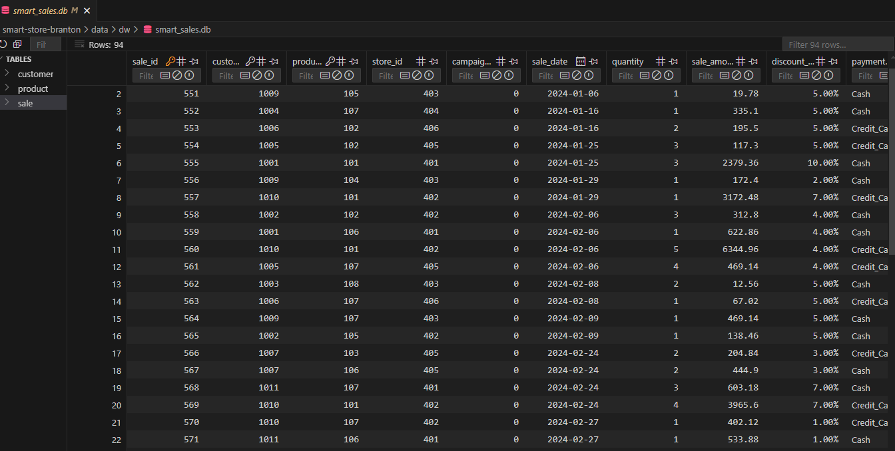
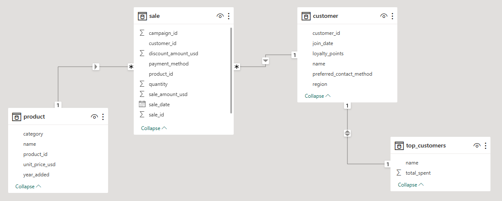
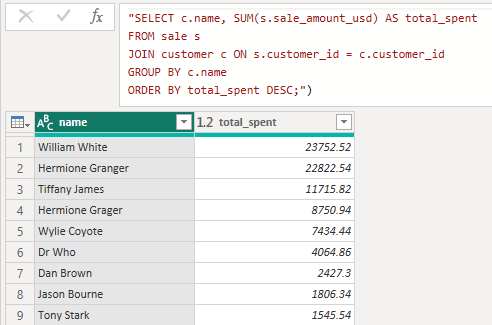
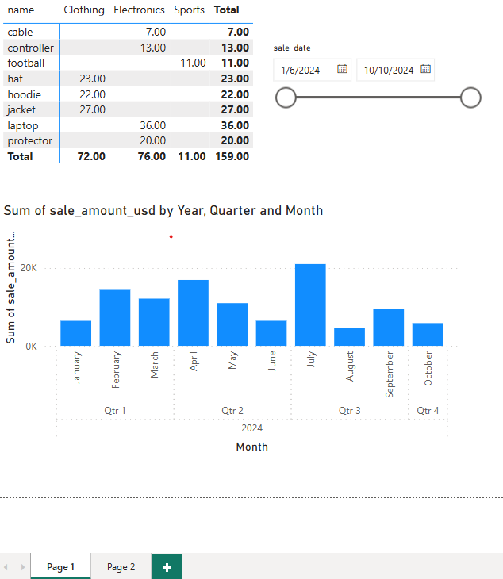
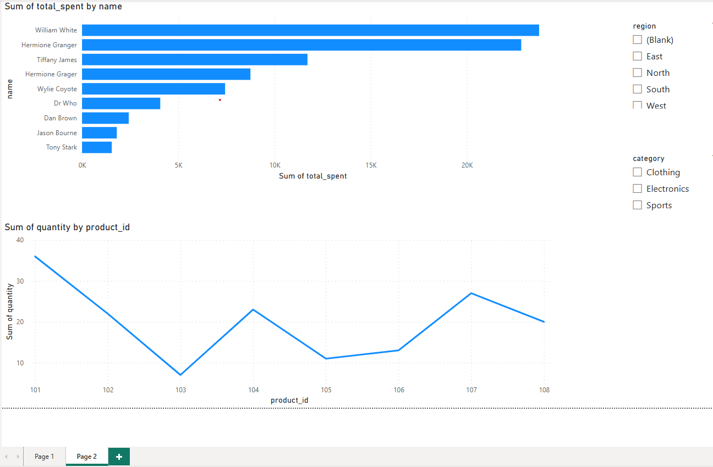

# Smart Sales Starter Files

Starter files to initialize the Smart Sales project.

---

## Project Setup Guide (Windows)

Run all commands from a PowerShell terminal in the root project folder.

### Step 1: Create a Local Project Virtual Environment
```shell
py -m venv .venv
```

### Step 2A - Create a Local Project Virtual Environment

```shell
py -m venv .venv
```

### Step 2B - Activate the Virtual Environment

```shell
.venv\Scripts\activate
```

### Step 2C - Install Packages

```shell
py -m pip install --upgrade pip setuptools wheel
py -m pip install --upgrade -r requirements.txt
```

### Step 2D - Optional: Verify .venv Setup

```shell
py -m datafun_venv_checker.venv_checker
```

### Step 2E - Run the initial project script to setup prepared data from project root

```shell
py scripts/data_prep.py
```
### Git to pull changes from Github Project repo

git pull origin main

### Git add all new files to source control

git add .

### Git commit with a message (-m) in quotes telling what you did

git commit -m "add starter files"

### Git push the changes to the origin (the web address of your repo in GitHub) on branch main (the default branch we will use throughout the course

git push -u origin main

### Update the README.md to record project commands and workflow

git add .
git commit -m "Update README with commands"
git push

-----

## Initial Package List for the requirements.txt file

- pip
- loguru
- ipykernel
- jupyterlab
- numpy
- pandas
- matplotlib
- seaborn
- plotly
- pyspark==4.0.0.dev1
- pyspark[sql]
- git+<https://github.com/denisecase/datafun-venv-checker.git#egg=datafun_venv_checker>

## Project 3 Data Scrubber Section Objectives and Scripts

## Reusable Cleaning with a DataScrubber Class

## scripts/data_scrubber.py

## test data_scrubber with this test script: tests/test_data_scrubber.py - imports/test the DataScrubber methods

## Data prep:  recommend having a script for each raw data file

## Activate .venv

## In Windows PowerShell terminal

.\.venv\Scripts\activate

## Run Test Script

py tests\test_data_scrubber.py

## Create or Edit Your Main Data Prep script(s)

## In your main data preparation script (e.g., scripts\data-prep.py) - or scripts. There can be a LOT of work in cleaning, you might want to create and maintain one data_prep file for each of the raw tables, for example you might have either all in one

## scripts/data_prep.py

## Or several files

## scripts/data_prep_cutomers.py

## scripts/data_prep_products.py

## scripts/data_prep_sales.py

git add .
git commit -m "Add updates to README.md and Data Scrubber scripts"
git push -u origin main

## Module 4 Execute the script to create the database and tables.  Goal: Use SQLite to define and create tables for your data warehouse. The script will set up the database schema based on your design

py scripts/create_dw.py

## Finish the code to actually create tables using the initial columns To allow the script to be re-run while we are finalizing it, delete the new database if it exists before each run.  Then run the below script to populate the data warehouse

python3 scripts/etl_to_dw.py



## Update Github repository

git add .
git commit -m "Add etl_to_dw.py and smart_sales.db. Updated create_dw.py and README.me"
git push -u origin main

## Module 5 apply core BI techniques (slicing, dicing, and drilldown) and generate interactive visualizations to explore business performance. This project reinforces key data analysis and reporting skills

## Install Power BI Desktop from: https://powerbi.microsoft.com/downloads

## Install SQLite ODBC Driver  from: https://www.ch-werner.de/sqliteodbc

## Configure ODBC Data Source Name (DSN).   Install SQLite3 64-bit version.  Setup/Connect to SmartSalesDSN

## Power BI Desktop connect to ODBC DSN SmartSalesDSN and select tables to analyze (Customer, Product and Sale).  Use Model view to see table connections. Next Tranform data to open Power Query Editor. Use Advanced Editor to create new SQL query and save as top_customers. Add date range slicer and matrix visual with drill-through. Create visualization for Top Customers and Sales Trends with slicer by categories and region. Document M5

1. The Top Customer query was used to show customer spending from most to least spent.
2. I kept all the dashboard visual and stored on page 1 and page 2.  Page 1 has a sale date slicer with a matrix table showing a quantity of each product sold by category.  This paga also contains sames amount by Year, Quarter or Month depending on drill down. Page 2 has a bar graph of total spend by customer and below a quantity by product ID with a region and category slicer.
3. 
4. 
5.   

## Git Add-Commit-Push - do this at the end, but good to do after each improvement

git add .
git commit -m "Completed analysis and visualization"
git push -u origin main


