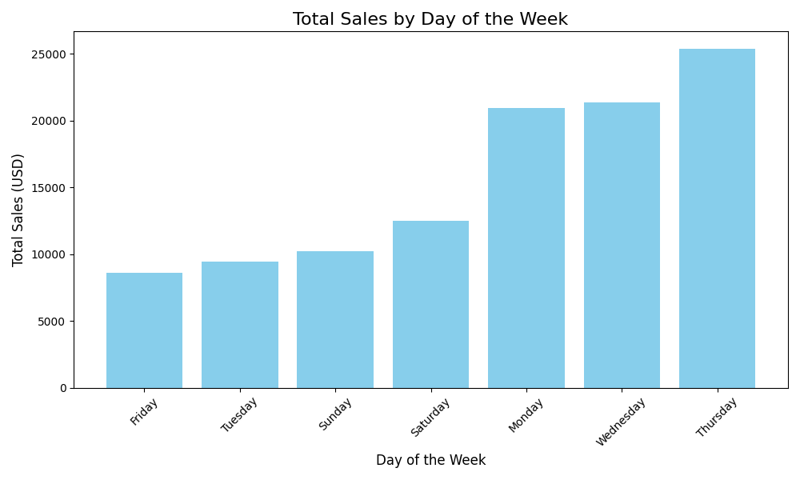

# Smart Sales Starter Files

Starter files to initialize and analyze the Smart Sales project.

---

## Project Setup Guide (Windows)

Run all commands from a PowerShell terminal in the root project folder.

### Step 1: Create and Activate a Virtual Environment
```shell
py -m venv .venv
.venv\Scripts\activate
```

### Step 2: Install Required Packages
```shell
py -m pip install --upgrade pip setuptools wheel
py -m pip install --upgrade -r requirements.txt
```

### Step 3: Verify Virtual Environment Setup (Optional)
```shell
py -m datafun_venv_checker.venv_checker
```

### Step 4: Run Initial Data Preparation Script
```shell
py scripts/data_prep.py
```

---

## Git Workflow

### Pull Changes from the Repository
```shell
git pull origin main
```

### Add All New Files to Source Control
```shell
git add .
```

### Commit Changes with a Message
```shell
git commit -m "Your commit message here"
```

### Push Changes to the Repository
```shell
git push -u origin main
```

---

## Initial Package List (`requirements.txt`)
- pip
- loguru
- ipykernel
- jupyterlab
- numpy
- pandas
- matplotlib
- seaborn
- plotly
- pyspark==4.0.0.dev1
- pyspark[sql]
- git+<https://github.com/denisecase/datafun-venv-checker.git#egg=datafun_venv_checker>

---

## Database Setup

### Create the Database and Tables
Run the script to define and create tables for your data warehouse:
```shell
py scripts/create_dw.py
```

### Populate the Data Warehouse
Run the ETL script to populate the database:
```shell
python3 scripts/etl_to_dw.py
```

---

## Business Intelligence (BI) Analysis

### Module 5: Interactive Visualizations
1. Install Power BI Desktop: [Download Power BI](https://powerbi.microsoft.com/downloads)
2. Install SQLite ODBC Driver: [Download SQLite ODBC](https://www.ch-werner.de/sqliteodbc)
3. Configure ODBC Data Source Name (DSN) for `SmartSalesDSN`.
4. Use Power BI to connect to the database and create visualizations:
   - Sales trends by year, quarter, or month.
   - Top customers and sales by region or category.

---

## Module 6: BI Insights and Storytelling

### Section 1: Business Goals
1. Analyze sales by day of the week and product to determine staffing needs.
2. Analyze sales by region to identify areas for improvement.
3. Analyze sales by month to understand seasonal spending patterns.

### Section 2: Data Source
- Data used: `smartsales.db`
- Fields: `sale_id`, `customer_id`, `product_id`, `sale_amount_usd`, and `region`.
- Aggregations: Sales were summed, and `sale_id` was counted for reporting.

### Section 3: Tools
- OLAP and Cubing Scripts were used to analyze data and generate insights.

### Section 4: Workflow & Logic
- **Dimensions:** `DayOfWeek`, `Month`, `Region`, `product_id`, and `customer_id`.
- **Metrics:** Sum and mean of `sale_amount_usd`, and count of `sale_id`.

### Section 5: Results
#### Insights with Visualizations:
- **Sales by Day and Product**
  
- **Sales by Day of Week**
  
- **Sales by Month and Product**
  
- **Sales by Region**
  
- **Month Details**
  

#### Key Findings:
- **Least Profitable Day:** Friday with revenue of $8,617.76.
- **Least Profitable Region:** West with revenue of $4,233.64.
- **Least Profitable Months:** May and June.
- **Top Product:** Product ID 101 (laptop).

### Section 6: Suggested Business Actions
1. Adjust operating hours on Fridays.
2. Introduce new products or promotions for May and June.
3. Share best practices from the East region to improve sales in other regions.

### Section 7: Challenges
- Minor issues with the logger script and OLAP scripts were resolved using Copilot.

---

## Git Final Steps
After completing your analysis and visualizations:
```shell
git add .
git commit -m "Completed analysis and visualization"
git push -u origin main
```

## Module 7

The goal will be to determine high return rates based on region, customer, product, sales rep and by year.
Used Python and SQLite and modified data_prep.py to prep the P7 csv data files and place in data/prepared folder.
Added new p7_create_dw.py and p7_etl_to_dw.py that create slqlite database called store_returns.db.
Used Power BI to aggregate and visualize the data.

