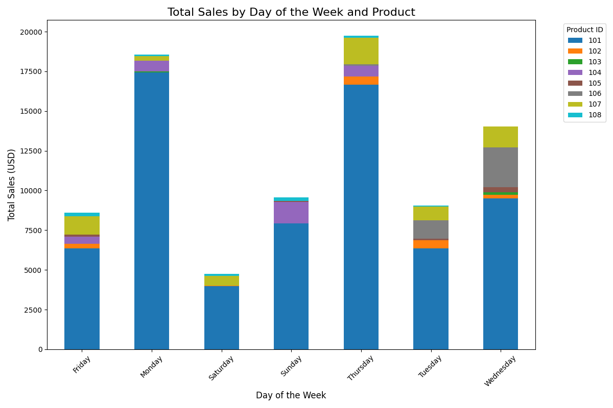

# Smart Sales Starter Files

Starter files to initialize and analyze the Smart Sales project.

---

## Project Setup Guide (Windows)

Run all commands from a PowerShell terminal in the root project folder.

### Step 1: Create and Activate a Virtual Environment

```shell
py -m venv .venv
.venv\Scripts\activate
```

### Step 2: Install Required Packages

```shell
py -m pip install --upgrade pip setuptools wheel
py -m pip install --upgrade -r requirements.txt
```

### Step 3: Verify Virtual Environment Setup (Optional)

```shell
py -m datafun_venv_checker.venv_checker
```

### Step 4: Run Initial Data Preparation Script

```shell
py scripts/data_prep.py
```

---

## Git Workflow

### Pull Changes from the Repository

```shell
git pull origin main
```

### Add All New Files to Source Control

```shell
git add .
```

### Commit Changes with a Message

```shell
git commit -m "Your commit message here"
```

### Push Changes to the Repository

```shell
git push -u origin main
```

---

## Initial Package List (`requirements.txt`)

- pip
- loguru
- ipykernel
- jupyterlab
- numpy
- pandas
- matplotlib
- seaborn
- plotly
- pyspark==4.0.0.dev1
- pyspark[sql]
- git+<https://github.com/denisecase/datafun-venv-checker.git#egg=datafun_venv_checker>

---

## Database Setup

### Create the Database and Tables

Run the script to define and create tables for your data warehouse:

```shell
py scripts/create_dw.py
```

### Populate the Data Warehouse

Run the ETL script to populate the database:

```shell
python3 scripts/etl_to_dw.py
```

---

## Business Intelligence (BI) Analysis

### Module 5: Interactive Visualizations

1. Install Power BI Desktop: [Download Power BI](https://powerbi.microsoft.com/downloads)
2. Install SQLite ODBC Driver: [Download SQLite ODBC](https://www.ch-werner.de/sqliteodbc)
3. Configure ODBC Data Source Name (DSN) for `SmartSalesDSN`.
4. Use Power BI to connect to the database and create visualizations:
   - Sales trends by year, quarter, or month.
   - Top customers and sales by region or category.

---

## Module 6: BI Insights and Storytelling

### Section 1: Business Goals

1. Analyze sales by day of the week and product to determine staffing needs.
2. Analyze sales by region to identify areas for improvement.
3. Analyze sales by month to understand seasonal spending patterns.

### Section 2: Data Source

- Data used: `smartsales.db`
- Fields: `sale_id`, `customer_id`, `product_id`, `sale_amount_usd`, and `region`.
- Aggregations: Sales were summed, and `sale_id` was counted for reporting.

### Section 3: Tools

- OLAP and Cubing Scripts were used to analyze data and generate insights.

### Section 4: Workflow & Logic

- **Dimensions:** `DayOfWeek`, `Month`, `Region`, `product_id`, and `customer_id`.
- **Metrics:** Sum and mean of `sale_amount_usd`, and count of `sale_id`.

### Section 5: Results

#### Insights with Visualizations

- **Sales by Day and Product**
  
- **Sales by Day of Week**
  
- **Sales by Month and Product**
  
- **Sales by Region**
  
- **Month Details**
  

#### Key Findings

- **Least Profitable Day:** Friday with revenue of $8,617.76.
- **Least Profitable Region:** West with revenue of $4,233.64.
- **Least Profitable Months:** May and June.
- **Top Product:** Product ID 101 (laptop).

### Section 6: Suggested Business Actions

1. Adjust operating hours on Fridays.
2. Introduce new products or promotions for May and June.
3. Share best practices from the East region to improve sales in other regions.

### Section 7: Challenges

- Minor issues with the logger script and OLAP scripts were resolved using Copilot.

---

## Git Final Steps

After completing your analysis and visualizations:

```shell
git add .
git commit -m "Completed analysis and visualization"
git push -u origin main
```

## Module 7: Returns Analysis

### Section 1: The Business Goal
To identify areas of concern regarding product returns by customer, state, region, category, date, and product.

---

### Section 2: Data Source
- **Dataset**: [Superstore Sample Data](https://github.com/PacktPublishing/Getting-Started-with-Tableau-2019.2/blob/master/Chapter03/Sample-Superstore.xlsx)
- **Descriptive Dimensions**:
  - `product_id`, `category`, `region`, `customer_id`, `sale_date`, and `state`
  - These dimensions were analyzed to understand return patterns.
- **Numeric Metrics**:
  - `cost`, `quantity`, and `sales`

---

### Section 3: Tools Used
- **Python**: For data cleaning and transformation using `pandas` and `sqlite3`.
- **Power BI**: For visualizations and DAX queries.
- **Copilot**: Assisted with resolving ETL and visualization challenges.

---

### Section 4: Workflow & Logic
1. **Data Preparation**:
   - Cleaned and transformed raw data using Python.
   - Loaded data into a data warehouse (`store_returns.db`).
2. **Aggregations**:
   - Summed metrics by dimensions.
   - Calculated return percentage of total sales.
3. **Slicing and Dicing**:
   - Sliced data by customer, product, category, and region.
   - Added options to view returns by year and dice further by state.
4. **Drilldown**:
   - Enabled drilldowns by customer or region to product ID.

---

### Section 5: Results

#### Key Metrics:
- **Total Returns**: $181,008.26
- **Total Sales**: $2,299,031.59
- **Overall Return Percentage**: 7.87%

#### Category-wise Returns:
| **Category**       | **Returns**   | **Sales**       | **Return %** |
|---------------------|---------------|-----------------|--------------|
| Technology          | $73,212.13   | $837,984.62     | 8.74%        |
| Furniture           | $59,219.21   | $741,999.98     | 7.98%        |
| Office Supplies     | $48,576.92   | $719,046.99     | 6.76%        |

#### Region-wise Returns:
| **Region**          | **Returns**   | **Sales**       | **Return %** |
|---------------------|---------------|-----------------|--------------|
| West                | $107,483.06  | $725,457.93     | 14.82%       |
| East                | $41,705.12   | $678,781.36     | 6.14%        |
| Central             | $14,006.99   | $501,239.88     | 2.79%        |
| South               | $17,309.13   | $391,721.90     | 4.42%        |
| North               | $503.96      | $1,830.52       | 27.53%       |

#### Yearly Trends:
- **Highest Return %**: 27.53% in 2025.
- **Lowest Return %**: 5.93% in 2016.

---

### Visualizations

#### Multiple Views of Returns


#### Sales and Returns Analysis

- **Visuals**:
  - Sales by Region: Area chart using `sale_date` and `sales`.
  - Sales and Returns by Category: Column chart showing Technology as the top category for both sales and returns.
  - Returns by Region: Area chart using Year and Total Returns.
  - Slicer: Drill down by state for total sales and returns.

#### Returns by State

- **Visuals**:
  - Filled map showing return dollars by state.
  - Slicer for drilling down to more detail by state.

#### Product Analysis

- **Key Metrics**: Total Sales, Total Profit, Product Return %
- **Visuals**:
  - Sales by Product: Column chart using `name` and `sales`.
  - Sales Distribution by Category: Pie chart using `category` and `sales`.
  - Profit by Product: Column chart using `name` and `profit`.
  - Profit Distribution by Category: Pie chart using `category` and `profit`.
  - Return Rate by Product: Column chart using `name` and Product Return %.
  - Return Rate Distribution by Category: Pie chart using `category` and Category Return %.

#### Customer Insights

- **Key Metrics**: Total Sales, Total Profit
- **Visuals**:
  - Sales by Customer Segment: Column chart using `segment` and `sales`.
  - Sales Distribution by Customer Segment: Pie chart using `segment` and `sales`.
  - Profit by Customer Segment: Column chart using `segment` and `profit`.
  - Profit Distribution by Customer Segment: Pie chart using `segment` and `profit`.

---

### Section 6: Suggested Business Actions
1. **Address High Return Rates**:
   - Focus on the **West region**, which has a return rate of 14.82%.
   - Drill down into **California** and **Washington** to identify specific issues.
2. **Investigate High-Return Products**:
   - The **Canon image CLASS 2200 Advanced Copier** had the highest return value ($13,999.96) but was also the most profitable product.
3. **Improve Processes in the North Region**:
   - The North region has a skewed return rate (27.53%) due to low sales volume.
4. **Monitor Category Trends**:
   - Technology has the highest return percentage (8.74%).

---

### Section 7: Challenges
- **Data Selection**:
  - Finding a large dataset was challenging but resolved with the Superstore dataset.
- **ETL Process**:
  - Encountered issues with Python scripts but resolved them using Copilot.
- **Power BI**:
  - Linking multiple tables from the data warehouse was challenging but resolved through trial and error with Copilot.

---

### Section 8: Ethical Considerations
- The dataset was publicly available and contained no personal or sensitive data.
- Added a few rows of data with future dates, which introduced potential bias in date-based analysis.

---

### Git Final Steps
After completing your analysis and visualizations:
```shell
git add .
git commit -m "Completed custom BI project"
git push -u origin main
```
